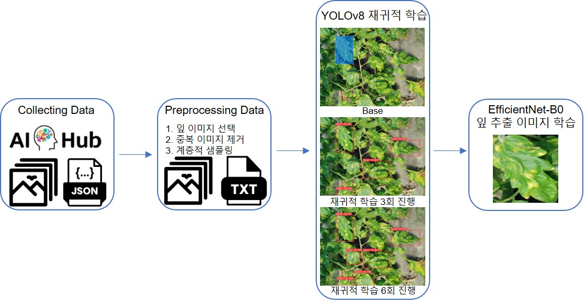

# 토마토 잎 병해 분류를 위한 최소 라벨 데이터 활용: YOLOv8 기반 재귀적 학습 방식



이 프로젝트는 클래스 불균형 문제를 극복하고 최소한의 라벨링 데이터만을 사용하여 토마토 잎의 병해를 효과적으로 분류하기 위한 새로운 방법론을 제안한다. YOLOv8 모델을 기반으로 한 재귀적 학습 방식을 통해, 학습 데이터의 예측 결과를 다시 학습 데이터로 활용함으로써 데이터 불균형 문제를 보다 근본적으로 해결하였다. 특히, 가장 적은 데이터를 가진 클래스인 잎마름역병 병해에서 기존 대비 12.9% 향상된 결과를 확인할 수 있다.

## 차별점

이 논문의 방식은 수도라벨링 기법을 변형하여 기존 데이터에서 새로운 객체(바운딩 박스)를 탐지하는 접근법을 적용했다. 객체 탐지 모델(YOLOv8)을 활용해 같은 이미지 내에서 추가적인 잎을 탐지하고, 이를 학습 데이터에 포함해 데이터의 양을 점진적으로 늘렸다.

탐지 과정에서 confidence score는 모델이 예측한 바운딩 박스의 신뢰도를 평가하는 기준으로 사용되며, 25% 이상의 신뢰도를 가진 예측만 추가된다. 또한, IoU(Intersection over Union)은 NMS(Non-Maximum Suppression) 단계에서 중복된 바운딩 박스를 제거하는 기준으로 활용된다. NMS는 서로 겹치는 바운딩 박스 중 IoU 50% 이상인 경우, confidence score가 가장 높은 바운딩 박스를 남기고 나머지는 제거해 예측 결과의 품질을 보장하는 역할을 한다.

이러한 설정은 토마토 잎 질병 데이터의 특성을 반영하여, 이미지 내 다수의 잎에 대한 병해 정보를 효과적으로 활용하고 신뢰할 수 있는 데이터를 구축하도록 설계된 접근법이다.

## 주요 특징

- **클래스 불균형 해결**
    -   기존 데이터 증강 및 샘플링 방법과 달리, 실제 라벨 데이터 활용을 극대화하여 클래스 불균형 문제에 대응
- **재귀적 학습 방식**
    -   YOLOv8 모델을 사용하여 학습 데이터에 대한 예측 결과를 다시 학습에 활용, 점진적으로 클래스 개수를 증가
- **고정확도 달성**
    -   본 방법론을 통해 98.92%의 높은 정확도로 토마토 잎 병해를 분류
- **실용적 응용 가능성**
    -   이 연구는 다른 작물의 병해 분류에도 적용될 수 있는 방법론을 제시

## 실험 결과

EfficientNet-B0 모델을 사용한 실험에서는 다양한 설정에 따라 이미지의 테스트 정확도와 클래스별 정확도를 평가하였다.

### 주요 발견 사항:
- **Base 설정**: 원본 이미지에서 97.66%의 정확도를 달성하였으며, 잎 추출 이미지에서는 93.63%의 정확도를 보였다.
- **Base + Leaf Crop 설정**: 잎 이미지만을 추출하여 학습한 결과, 원본 이미지에 대한 정확도는 소폭 감소하였으나, 잎 추출 이미지에서는 정확도가 98.60%로 증가하였다. 이는 이미지 분할을 통한 학습이 성능 향상에 기여할 수 있음을 보여준다.
- **YOLOv8 R3 + Leaf Crop**: 이 설정은 원본 및 잎 추출 이미지 모두에서 가장 높은 정확도(98.92%)를 달성하며, 재귀적 학습 방법론이 예측 모델 성능에 중요한 영향을 미칠 수 있음을 확인하였다.
- **성능 저하 관찰**: YOLOv8 R4 설정 이후, 성능 저하가 관찰되었는데, 이는 재귀적 학습의 반복이 증가함에 따라 특정 기준에 따른 이미지 삭제 및 조정이 필요함을 시사한다.

### 클래스별 성능:
- **잎 추출 이미지에서의 학습**: 잿빛 곰팡이병과 잎마름역병에서 낮은 성능을 보인 'Base' 설정에 비해, 잎 이미지를 학습한 설정이 효과적으로 성능을 향상시켰다.
- **특정 병해 탐지에서의 향상**: 재귀적 학습 방법론을 적용한 설정은 특히 데이터가 적은 병해에서 성능이 크게 향상되었으며, 이는 병해 탐지에 있어서 재귀적 학습 방법론이 매우 효과적일 수 있음을 시사한다.

### <표 7> 모델 테스트 정확도
| 실험 설정            | 원본 이미지 (EfficientNet) | 잎 추출 이미지 (EfficientNet) |
|----------------------|----------------------------|-------------------------------|
| Base                 | 97.66%                     | 93.63%                        |
| Base + Leaf Crop     | 97.59%                     | 98.60%                        |
| YOLOv8 R1 + Leaf Crop| 97.12%                     | 97.78%                        |
| YOLOv8 R2 + Leaf Crop| 97.94%                     | 98.88%                        |
| YOLOv8 R3 + Leaf Crop| 97.94%                     | 98.92%                        |
| YOLOv8 R4 + Leaf Crop| 97.38%                     | 98.45%                        |
| YOLOv8 R5 + Leaf Crop| 97.08%                     | 98.67%                        |
| YOLOv8 R6 + Leaf Crop| 86.02%                     | 98.08%                        |

### <표 8> 잎 추출 이미지에 대한 클래스별 모델 테스트 정확도
| 병해                  | Base       | Base+Leaf Crop | YOLOv8 R1+Leaf Crop | YOLOv8 R2+Leaf Crop | YOLOv8 R3+Leaf Crop |
|-----------------------|------------|----------------|---------------------|---------------------|---------------------|
| 정상                | 97.11%     | 99.40%         | 99.55%              | 99.76%              | 99.76%              |
| 흰가루병             | 95.58%     | 97.01%         | 96.19%              | 97.35%              | 97.76%              |
| 잿빛곰팡이병            | 84.63%     | 98.25%         | 95.63%              | 99.04%              | 98.69%              |
| 황화잎말이바이러스병    | 98.54%     | 99.27%         | 100.00%             | 99.27%              | 99.27%              |
| 잎곰팡이병           | 95.41%     | 99.08%         | 99.08%              | 97.25%              | 99.08%              |
| 잎마름역병          | 29.03%     | 87.10%         | 96.77%              | 100.00%             | 93.55%              |

이 결과들은 YOLOv8 모델과 EfficientNet-B0를 결합한 재귀적 학습 방법론이 토마토 잎 병해 분류에 효과적임을 보여주며, 특히 클래스 불균형이 심한 상황에서도 높은 정확도를 달성할 수 있음을 입증한다.

### 필수 요구 사항

- Python 3.11
- PyTorch 2.1.1
- 기타 필요한 패키지는 `Dockerfile` 참조
  

### 설치

```bash
git clone https://github.com/junhyuk0708/KoTomatoLeafDiseaseClassifier.git
```

## 중심어

-  클래스 불균형, 재귀적 학습, YOLOv8, EfficientNet, 토마토 병해
